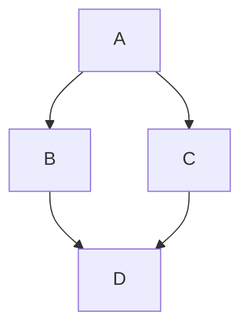

# H1 标题
## H2 标题
### H3 标题
#### H4 标题
##### H5 标题
###### H6 标题


普通段落文字

**加粗** 或 __加粗__
*斜体* 或 _斜体_
***加粗斜体***
~~删除线~~
`行内代码`


- 无序列表项
  - 子项
1. 有序列表项
- [ ] 任务列表（未完成）
- [x] 任务列表（已完成）


> 这是一行普通引用块。
> 可以换行继续写。


这里有一个脚注[^1]

[^1]: 脚注的具体解释内容


> An example showing the **tip** type prompt.
{: .prompt-tip}

> An example showing the **info** type prompt.
{: .prompt-info}

> An example showing the **warning** type prompt.
{: .prompt-warning}

> An example showing the **danger** type prompt.
{: .prompt-danger}


```python
def hello():
    print("Hello Chirpy!")


```

# 隐藏行号
echo "Hello"
``` {: .nolineno}


```python
# 内容
``` {: file="hello.py"}


```

| Company              | Contact      | Country |
|----------------------|--------------|---------|
| Alfreds Futterkiste  | Maria Anders | Germany |
| Island Trading       | Helen Bennett| UK      |


[ \sum_{n=1}^\infty \frac{1}{n^2} = \frac{\pi^2}{6} ]

[ x = \frac{-b \pm \sqrt{b^2 - 4ac}}{2a} ]




gantt
    title 项目时间表
    section 阶段1
    任务1 :a1, 2026-01-01, 30d


{: width="700" height="400"}

{: .left}

{: .right}

{: .dark}

{: .light}

{: .shadow}


